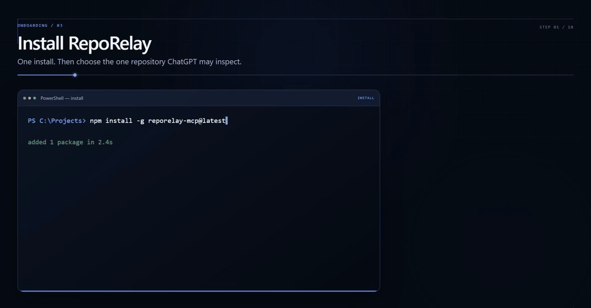

<p align="center">
  <picture>
    <source media="(prefers-color-scheme: dark)" srcset="docs/assets/reporelay-logo-dark.png">
    
  </picture>
</p>

<p align="center"><b>Give AI access to your repository &mdash; not your machine.</b></p>

<p align="center">RepoRelay lets ChatGPT safely inspect one local repository
without giving it control of the rest of your computer.</p>

<p align="center">
  <a href="https://github.com/Lukie-81/RepoRelay/actions/workflows/ci.yml"></a>
  <a href="LICENSE"></a>
  <a href="#before-you-install">=22.19 <27"></a>
  
</p>

<p align="center">
  
</p>

<p align="center"><b>ChatGPT &rarr; Secure MCP Tunnel &rarr; tunnel-client &rarr; RepoRelay &rarr; one approved repository</b></p>

<p align="center"><b>Read safe files &middot; Search code &middot; One approved repository &middot; No shell &middot; No Git &middot; No arbitrary writes</b></p>

<p align="center">
  <a href="https://github.com/Lukie-81/RepoRelay/raw/refs/heads/main/docs/assets/reporelay-demo.mp4">
    
  </a>
</p>

<p align="center">
  <a href="https://github.com/Lukie-81/RepoRelay/raw/refs/heads/main/docs/assets/reporelay-demo.mp4"><b>Watch the full demo &rarr;</b></a>
</p>

<p align="center">
  <a href="#quick-setup">Quick Setup</a> &middot;
  <a href="#youre-connected--what-now">Use It</a> &middot;
  <a href="#chatgpt--coding-agent-handoff">Handoff</a> &middot;
  <a href="#troubleshooting">Troubleshooting</a> &middot;
  <a href="#security">Security</a>
</p>

## What RepoRelay does

RepoRelay is a local, first-party MCP bridge that gives ChatGPT **bounded
access to exactly one approved repository on your computer** &mdash; nothing more.

ChatGPT reviews your code through RepoRelay, and can leave a structured task
for a separate local coding agent (like Codex or Claude) through fixed handoff
files. RepoRelay is the security boundary between ChatGPT and your machine.

```text
ChatGPT reviews/plans
        ↓
RepoRelay
        ↓
Repository reads/searches
+
fixed .ai-handoff writers
        ↓
Codex / another local coding agent implements
```

## How the safety model works

MCP (Model Context Protocol) is the standard that lets ChatGPT call tools.
ChatGPT is the MCP client. RepoRelay is the local MCP server and security
boundary: it decides what ChatGPT may access and exposes exactly one approved
repository at a time. `tunnel-client` is only the secure networking pipe that
carries ChatGPT traffic to your computer.

| Component | Job |
| --- | --- |
| ChatGPT | MCP client — chooses RepoRelay tools. |
| Secure MCP Tunnel | Carries traffic from ChatGPT to your computer. |
| `tunnel-client` | Local network forwarder; points the tunnel at RepoRelay. |
| RepoRelay | MCP server + security boundary; enforces authentication and allowed access. |
| Repository | The one directory ChatGPT is allowed to inspect. |

**What ChatGPT can do through RepoRelay (the normal 7-tool setup):**

```text
✓ inspect files          open_workspace, list_files, read_file
✓ search the repository  search_files
✓ write to three predetermined handoff targets
                         write_next_task, write_review, update_handoff_state
```

**What ChatGPT cannot do:**

```text
✗ run shell commands
✗ run PowerShell
✗ run Git
✗ launch processes
✗ arbitrarily edit source files
✗ delete files
✗ choose arbitrary write targets
✗ access outside the approved repository
```

This is one of RepoRelay's strongest differentiators: ChatGPT can read and plan
against your code, but it gets **no execution capability** and can only write to
a few fixed handoff files you control.

## Before you install

You need:

- **Node.js** `>=22.19` and `<27` (npm is included). Check with
  `node --version`.
- **An existing local project or repository** you want ChatGPT to review. It
  must be a real folder on your computer &mdash; not a drive root and not your
  whole user folder.
- **OpenAI Secure MCP Tunnel access.** RepoRelay reaches ChatGPT through
  OpenAI's Secure MCP Tunnel. See the current
  [OpenAI Secure MCP Tunnel guide](https://developers.openai.com/api/docs/guides/secure-mcp-tunnels)
  for availability, permissions, and plan details.
- **Permission to create/use a custom MCP app** in the target ChatGPT
  workspace (ChatGPT developer mode).

You do **not** need to download anything else. RepoRelay installs the official
OpenAI `tunnel-client` automatically during `reporelay tunnel setup`.

Do not worry about the handoff protocol yet. The quickstart sets up working
handoff files for you and explains them as you go.

## Quick setup

> **Windows paths.** Always quote the full path and keep the backslashes:
>
> ```powershell
> reporelay quickstart "C:\Users\you\Projects\my-app"
> ```
>
> `C:\Users\you\Projects\my-app` is correct. `C:Users\you\Projects\my-app` is
> not &mdash; the backslashes matter.

### 1. Install RepoRelay

```powershell
npm install -g reporelay-mcp@latest
```

Check the install:

```powershell
reporelay --version
```

If `reporelay` is not recognized, see [Troubleshooting](#troubleshooting).

### 2. Start RepoRelay on one repository

```powershell
reporelay quickstart "C:\Projects\my-app"
```

Replace the path with the repository you want to expose. Keep this PowerShell
window open.

You should see:

```text
Ready.
Local MCP: http://127.0.0.1:7676/mcp
```

The normal quickstart enables the **7-tool handoff surface** (4 inspection
tools + 3 fixed handoff writers). RepoRelay now creates a small `.ai-handoff`
workspace and an `AGENTS.md` note so ChatGPT can leave structured tasks and
reviews for a separate local coding agent:

```text
.ai-handoff/NEXT_TASK.md
.ai-handoff/REVIEW.md
.ai-handoff/RESULT.md
.ai-handoff/STATE.json
AGENTS.md
```

**Why does RepoRelay create these?** ChatGPT still cannot run commands, use
Git, or arbitrarily edit your repository. These files are simply a place where
ChatGPT can leave a task, and a separate local coding agent (running on your
own machine, with your own permission) can leave its result. More below in
[ChatGPT ↔ coding-agent handoff](#chatgpt--coding-agent-handoff).

To stop RepoRelay later, press **Ctrl+C** in this window. There is no
`reporelay quickstart --stop`.

### 3. Audit it

Immediately after quickstart, verify RepoRelay's actual security boundary:

```powershell
reporelay audit "C:\Projects\my-app"
```

You should see:

```text
RESULT: PASS
```

Audit starts its own temporary loopback listener and exercises the real
authenticated MCP surface, containment checks, and handoff restrictions. It
does not modify your repository. This validates RepoRelay *before* ChatGPT is
connected.

### 4. Run RepoRelay tunnel setup

In a **second** PowerShell window, run:

```powershell
reporelay tunnel setup
```

This starts the RepoRelay setup wizard. It does everything for you:

```text
✓ installs a RepoRelay-supported OpenAI tunnel-client
✓ verifies it (pinned version + official SHA-256)
✓ opens OpenAI tunnel setup
✓ asks for your tunnel ID
✓ opens OpenAI runtime-key setup
✓ securely stores the pasted key
✓ creates the tunnel profile
✓ tests the complete connection
```

You provide exactly two things, both in OpenAI Platform:

1. **Your Secure MCP Tunnel ID** — the wizard opens
   <https://platform.openai.com/settings/organization/tunnels> in your
   browser. Create or select a tunnel, associate it with your ChatGPT
   workspace, and paste its `tunnel_id` back in the terminal.
2. **A runtime API key** — the wizard opens
   <https://platform.openai.com/settings/organization/api-keys>. Create a
   secret key for the project you use with the tunnel and paste it in the
   terminal. Input is hidden: nothing appears while you paste. This key
   authenticates `tunnel-client` to OpenAI; it is **not** the RepoRelay
   bridge secret.

Creating or editing a tunnel needs the **Tunnels Read + Manage** permission;
running `tunnel-client` or selecting the tunnel needs **Tunnels Read + Use**.
These are organization-level permissions granted by your org owner or RBAC
admin. Follow the current
[OpenAI Secure MCP Tunnel guide](https://developers.openai.com/api/docs/guides/secure-mcp-tunnels)
for the exact UI and permission details.

When the wizard finishes, you should see:

```text
Testing connection...
✓ OpenAI runtime credential
✓ RepoRelay reachable
✓ Bridge authentication

Setup complete.

Next:
  reporelay tunnel run
```

If your RepoRelay runs on a custom port (for example `--port 7677`),
quickstart already recorded the live endpoint and setup follows it
automatically &mdash; no extra flags needed.

Useful options:

- `reporelay tunnel setup --no-open` — do not launch the browser (headless,
  SSH, or CI); the URLs are still printed.
- `reporelay tunnel setup --replace-tunnel` — prompt for a new tunnel ID.
- `reporelay tunnel setup --replace-runtime-key` — prompt for a new runtime
  API key.
- `reporelay tunnel setup --tunnel-client-path "C:\custom\tunnel-client.exe"`
  — **advanced override** for unusual environments; RepoRelay does not verify
  or manage a custom binary.

Re-running `reporelay tunnel setup` reuses your existing verified client,
tunnel ID, and stored key, and re-tests the connection without asking for
anything again.

### 5. Run the tunnel

```powershell
reporelay tunnel run
```

Keep this window open alongside the RepoRelay quickstart window. Stop it with
Ctrl+C when you are done.

If the connection ever stops working, `reporelay tunnel doctor` remains
available as a standalone troubleshooting command (expect `Ready.` when
everything is healthy; add `--verbose` for redacted diagnostics).

### 6. Create the ChatGPT app

In ChatGPT, using the current OpenAI flow (see the
[ChatGPT developer-mode and MCP apps guide](https://help.openai.com/en/articles/12584461-developer-mode-and-mcp-apps-in-chatgpt)):

```text
ChatGPT
→ Apps / developer features
→ create custom MCP app
→ connection: Tunnel
→ choose RepoRelay's tunnel
→ authentication: No authentication
→ Scan Tools
→ verify 7 tools
→ create/use the app
→ start a new chat
```

Follow this sequence:

1. Create the custom MCP app.
2. Choose the **Tunnel** connection.
3. Select the RepoRelay/OpenAI Secure MCP Tunnel.
4. When ChatGPT asks for authentication, select **No authentication**.
5. Save or create the app.
6. Run **Scan Tools**.
7. Verify the expected RepoRelay tools appear.
8. Start a new chat and select the RepoRelay app.

> **Authentication: No authentication.** RepoRelay already authenticates the
> local bridge through the protected `X-RepoRelay-Bridge-Secret` used by the
> tunnel. Do not configure OAuth or another ChatGPT-side authentication method.

Never paste `127.0.0.1`, `localhost`, the RepoRelay bridge secret, or an OpenAI
runtime API key into ChatGPT. The tunnel connection does all the networking.

### 7. Scan and verify the 7 RepoRelay tools

In the ChatGPT app flow, run **Scan Tools** and confirm RepoRelay exposes
exactly these seven tools:

```text
open_workspace
list_files
read_file
search_files
write_next_task
write_review
update_handoff_state
```

That is the expected normal surface. If Scan Tools shows shell, Git, process
execution, generic file editing, delete, patching, or any other unexpected
capability, **stop and investigate** before using the app &mdash; run
`reporelay audit "C:\Projects\my-app" --json` and confirm the tool list.

### 8. Test it

Start a new chat, select the RepoRelay app, and try:

```text
Open the approved repository and list its top-level files.
```

Then test the boundary:

```text
Try to read .env.
```

The second request should be blocked.

## You're connected — now what?

You now have ChatGPT reviewing your repository through a verified security
boundary. Useful prompts:

```text
Read README.md and explain how this project starts.
```

```text
Search the repository for "authentication".
```

```text
Review src/server.ts for error-handling issues and write your findings.
```

## ChatGPT ↔ coding-agent handoff

The normal RepoRelay setup lets ChatGPT plan and review while a separate local
coding agent (Codex, Claude, or another) does the implementation. RepoRelay
coordinates them through a small `.ai-handoff` workspace:

```text
.ai-handoff/
├── NEXT_TASK.md   ChatGPT writes the task here
├── RESULT.md      the local coding agent writes its result here
├── REVIEW.md      ChatGPT writes its review here
└── STATE.json     coordinates the cycle
```

Conceptually:

```text
ChatGPT
  ↓ writes NEXT_TASK.md

Codex / local coding agent
  ↓ implements
  ↓ writes RESULT.md

ChatGPT
  ↓ reviews result
  ↓ writes REVIEW.md
```

`STATE.json` coordinates the cycle. RepoRelay itself **does not run Codex or
Claude** &mdash; they are separate local applications you start yourself. The
handoff files are just a structured place to hand work back and forth.

ChatGPT can only write `NEXT_TASK.md`, `REVIEW.md`, and `STATE.json`. The
implementer-owned `RESULT.md` is never writable by ChatGPT.

See [docs/handoff-cycle.md](docs/handoff-cycle.md) for the detailed protocol
and [examples/](examples/) for reviewer and implementer prompts.

## Daily use

After the one-time setup, do not recreate the tunnel or the ChatGPT app. Each
day:

1. Start RepoRelay:

   ```powershell
   reporelay quickstart "C:\Projects\my-app"
   ```

2. Start the tunnel (in a second window):

   ```powershell
   reporelay tunnel run
   ```

3. Open ChatGPT, start a new chat, and select the existing RepoRelay app.

Keep both windows open while you use the app. If the connection stops working,
run `reporelay tunnel doctor` again.

## Switch repositories

**RepoRelay exposes one repository at a time.**

1. Press **Ctrl+C** in the RepoRelay terminal.
2. Start RepoRelay for the new repository:

   ```powershell
   reporelay quickstart "C:\Projects\another-repo"
   ```

3. Keep `tunnel-client` running. It reconnects to the restarted RepoRelay
   automatically (same port and protected bridge-secret file). If you used a
   different port, the managed tunnel follows it automatically.
4. Start a new ChatGPT conversation and select the RepoRelay app.
5. Ask ChatGPT to open the new repository.

Do not rescan tools just because the approved repository changed. Rescan only
if the tool definitions changed or ChatGPT asks you to.

## Troubleshooting

| You see | What to do |
| --- | --- |
| `'node' is not recognized` | Node.js is not installed, or PowerShell was opened before the install finished. Install Node.js from <https://nodejs.org>, close and reopen PowerShell, and check `node --version`. |
| `RepoRelay requires Node.js >=22.19 and <27` | Your Node version is unsupported. Install a supported Node.js LTS release, reopen PowerShell, and check `node --version`. |
| `'reporelay' is not recognized` | The npm install did not finish or PowerShell was opened before it finished. Re-run `npm install -g reporelay-mcp@latest`, close and reopen PowerShell, and try `reporelay --version`. |
| `Cannot find module ... dist\cli.js` | You are running from a source checkout in the wrong folder. `cd` into the `RepoRelay` folder and run `npm run build` first. |
| `C:Users\you\...` (path looks mangled) | You dropped the backslashes. Quote the full Windows path: `reporelay quickstart "C:\Users\you\Projects\my-app"`. |
| Repository does not exist / not a directory | RepoRelay requires an existing directory. Double-check the quoted path and that the folder exists. |
| Repository root is too broad | The approved root must be a real project folder, not a drive root or your whole user folder. |
| `Port 7676 is already in use` | Another RepoRelay or program is listening on that port. Press Ctrl+C in its window to stop it, or rerun quickstart with a custom port (`--port 7677`) — the managed tunnel follows the new port automatically. There is no `quickstart --stop`; stop RepoRelay with **Ctrl+C**. On Windows, find the listener with `Get-NetTCPConnection -LocalPort 7676 -State Listen | Select-Object LocalAddress, LocalPort, OwningProcess` and inspect it with `Get-Process -Id <PID>`. RepoRelay never kills processes for you. |
| Quickstart stops about an existing `AGENTS.md` | The repository already has an `AGENTS.md` without the RepoRelay marker. RepoRelay will not overwrite it. Review the file first; if you want RepoRelay to preserve it and append the marked handoff instructions, rerun `reporelay quickstart "..." --append-agent-instructions`. |
| `tunnel-client` missing | Rerun `reporelay tunnel setup`; it re-downloads and verifies the managed client. |
| Invalid tunnel ID | The ID must look like `tunnel_` followed by 32 hex characters. Copy it again from Platform tunnel settings. |
| Runtime credential rejected | Confirm the runtime API key and tunnel ID in Platform, and that your account has **Tunnels Read + Use**. Rerun `reporelay tunnel setup`. |
| Tunnel doctor cannot reach MCP | Keep the RepoRelay quickstart window running on the configured port, then rerun `reporelay tunnel doctor`. |
| Bridge authentication failure | Do not paste a secret. Confirm quickstart is using the canonical bridge-secret file, then rerun `reporelay tunnel setup`. |
| ChatGPT cannot see the tunnel | Check that the tunnel is associated with the target ChatGPT workspace (not only a Platform organization) and that you have tunnel-use permission. |
| Scan Tools returns zero tools | Keep both the RepoRelay and tunnel windows open, confirm `reporelay tunnel doctor` reports `Ready.`, then rescan in a **new** app/chat. |
| Scan Tools shows unexpected tools | Stop and investigate before using the app: run `reporelay audit "C:\Projects\my-app" --json` and confirm the expected 7-tool list. |
| RepoRelay window was closed | RepoRelay stopped. Restart it with `reporelay quickstart "C:\Projects\my-app"`, then try again in a new chat. |
| Tunnel window was closed | `tunnel-client` stopped. Restart it with `reporelay tunnel run`, then try again in a new chat. |
| Custom port mismatch | Confirm the RepoRelay quickstart port matches what `reporelay tunnel doctor` reports as the local MCP endpoint. Quickstart records the live endpoint automatically, or set it explicitly with `reporelay tunnel setup --port <port>`. |

For anything else, run `reporelay doctor`. It prints configuration and security
status without printing secret values.

## Optional read-only mode

The normal RepoRelay experience is the **7-tool handoff surface** above, and it
is the recommended beginner setup. If you specifically want ChatGPT to
**inspect only** &mdash; no handoff files, no writes at all &mdash; start with:

```powershell
reporelay quickstart "C:\Projects\my-app" --no-handoff-writes
```

In this optional mode RepoRelay exposes exactly four tools:

```text
open_workspace
list_files
read_file
search_files
```

Read-only mode does **not** create `.ai-handoff`, does **not** create or modify
`AGENTS.md`, and leaves the approved repository unchanged. All containment,
authentication, and security checks still apply. Use the matching audit flag:

```powershell
reporelay audit "C:\Projects\my-app" --no-handoff-writes
```

When you use this mode, expect **4 tools** in Scan Tools instead of 7.

## Security

RepoRelay's enforced boundary includes:

- loopback-only binding and authentication required;
- exactly one existing canonical approved root;
- sensitive paths blocked, including `.env`, VCS metadata, credential stores,
  and private-key formats;
- traversal, absolute outside-root paths, symlink/junction/reparse escapes, and
  hard-link bypasses blocked;
- bounded reads, searches, results, and handoff content;
- no shell, PowerShell, Git, process, generic write, patch, delete, artifact,
  worktree, skill, subagent, or local-agent tool;
- handoff writes limited to the three fixed pre-existing targets.

RepoRelay is a least-privilege application boundary, not an operating-system
sandbox against malicious software already running as the same local user. An
external Secure MCP Tunnel is a separate security boundary and must be secured
independently. Choose the approved repository carefully.

See [SECURITY.md](SECURITY.md) for the full security model and
`reporelay audit` documentation.

## Advanced configuration

Most users never need these. When you do:

- [Configuration](docs/configuration.md) — `REPORELAY_*` environment variables,
  bridge authentication, ports, logging, and handoff mode.
- [ChatGPT Web setup details](docs/chatgpt-web.md) — the full tunnel and app
  reference.
- [Windows operations](OPERATIONS.md) — lifecycle scripts, scheduled tasks, and
  managed Windows setup.
- [`.env.example`](.env.example) — placeholder configuration only. Never put a
  real bridge secret or tunnel credential in it.
- **Local MCP clients** — if your MCP client runs on the same computer as
  RepoRelay, you do not need the tunnel: point it at the local MCP URL printed
  by quickstart and send the `X-RepoRelay-Bridge-Secret` header loaded from the
  protected file.

For configuration and security status without printing secret values:

```powershell
reporelay doctor
```

## Requirements and platform support

- Node.js `>=22.19 <27` (npm is included);
- Git for the clone-based install — optional if you download the ZIP instead.

The quickstart in this README works on Windows, macOS, and Linux. Windows 10/11
is the fully validated lifecycle and operational platform, including the
PowerShell scripts and tunnel-managed runbook.

## Limitations

- One approved repository is exposed at a time.
- RepoRelay is not an operating-system sandbox.
- ChatGPT Web needs external OpenAI Secure MCP Tunnel infrastructure to reach a
  private local bridge.
- Windows is the fully validated lifecycle platform; other platforms do not
  have identical PowerShell/tunnel operations.
- Codex, Claude, and other coding agents are separate local applications, not
  components of RepoRelay.

## Documentation

- [ChatGPT Web setup](docs/chatgpt-web.md)
- [Security model](SECURITY.md)
- [Configuration](docs/configuration.md)
- [Windows operations](OPERATIONS.md)
- [Setup notes](docs/setup.md)
- [Handoff cycle](docs/handoff-cycle.md)
- [Handoff examples](examples/)
- [Contributing](CONTRIBUTING.md)

## License and project lineage

RepoRelay is released under the [MIT License](LICENSE). The project keeps its
required upstream attribution and does not bundle the SDKs or runtimes of
Codex, Claude, or other implementers.

## Development

```powershell
npm ci
npm run typecheck
npm test
npm run verify:release
npm audit --audit-level=low
npm pack --dry-run --json
git diff --check
```
