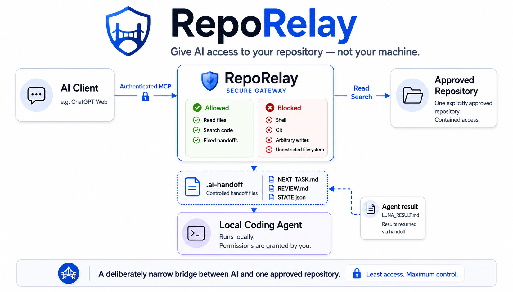

<p align="center">
  <picture>
    <source media="(prefers-color-scheme: dark)" srcset="docs/assets/reporelay-logo-dark.png">
    
  </picture>
</p>

<p align="center"><b>Give an AI reviewer your repository — not your machine.</b></p>

RepoRelay is a local-first MCP bridge for reviewing one explicitly approved
repository. It binds to loopback, requires a bridge secret, and exposes only
bounded repository read/search tools, with optional fixed `.ai-handoff` writers
for coordination with a separate coding agent.



## Quick start

Requirements: Node.js `>=22.19 <27` and npm. Windows PowerShell is the
validated lifecycle environment.

```powershell
npm ci
npm run build
reporelay quickstart "C:\path\to\approved-repository"
```

Quickstart validates the canonical repository root, creates the four
pre-existing handoff files, generates a protected bridge secret at
`%LOCALAPPDATA%\RepoRelay\reporelay-bridge-secret.txt`, starts the authenticated
loopback bridge, and self-tests the four/seven-tool surface. Use
`--no-handoff-writes` for read-only mode. Stop with Ctrl+C.

For a source checkout, use `node dist/cli.js` in place of `reporelay`.
`reporelay doctor` reports configuration and security status without printing
secret values.

The MCP client must send `X-RepoRelay-Bridge-Secret` with the value loaded from
the protected secret file. Never put that value in source, command history,
logs, handoff files, or tickets.

## Public MCP surface

Read-only mode exposes exactly four tools:

| Tool | Purpose |
| --- | --- |
| `open_workspace` | Open an existing repository inside the one approved root. |
| `list_files` | List a contained real directory. Links are blocked. |
| `read_file` | Read one bounded, non-sensitive regular file. |
| `search_files` | Search bounded repository text with a literal query. |

With `REPORELAY_HANDOFF_WRITES=1`, exactly three pathless writers are added:

| Tool | Fixed target |
| --- | --- |
| `write_next_task` | `.ai-handoff/NEXT_TASK.md` |
| `write_review` | `.ai-handoff/REVIEW.md` |
| `update_handoff_state` | `.ai-handoff/STATE.json` |

Writer schemas accept only `workspaceId` and `content`. Targets must already
exist as regular files. `.ai-handoff/RESULT.md` is written by the separate
implementer and is not writable through RepoRelay.

RepoRelay contains no active public path for shell or process execution, Git
operations, arbitrary writes or patches, deletes, artifacts, worktrees,
local-agent execution, agent SDK orchestration, bundled skills/subagents, OAuth
routes, database-backed workspace persistence, or a React UI workspace.

## Handoff cycle

```text
AI reviewer
    ↓
NEXT_TASK.md + STATE.json
    ↓
Codex or Claude implementer
    ↓
RESULT.md + STATE.json
    ↓
AI reviewer reads the implementation
    ↓
REVIEW.md + STATE.json
```

The reviewer may inspect the repository and, when enabled, update only the
three fixed coordination files. The implementer is a separate local actor with
its own authorization; a handoff file never grants it permissions.

See the provider-neutral examples in [`examples/`](examples/) and the
[sample handoff cycle](examples/sample-handoff-cycle/README.md).

## Configuration

The bridge is intentionally small. The important environment variables are:

```text
REPORELAY_HOST=127.0.0.1
REPORELAY_PORT=7676
REPORELAY_ALLOWED_ROOTS=<one absolute repository path>
REPORELAY_BRIDGE_AUTH=1
REPORELAY_BRIDGE_SECRET=<32+ characters from protected storage>
REPORELAY_HANDOFF_WRITES=0
REPORELAY_PUBLIC_BASE_URL=http://127.0.0.1:7676
REPORELAY_ALLOWED_HOSTS=127.0.0.1
REPORELAY_LOG_LEVEL=info
REPORELAY_LOG_FORMAT=json
REPORELAY_LOG_REQUESTS=1
REPORELAY_LOG_TOOL_CALLS=1
```

See [`.env.example`](.env.example) and [docs/configuration.md](docs/configuration.md).
Remote review requires an independently secured HTTPS tunnel that forwards to
the loopback listener and injects the same header. The tunnel is not bundled
with RepoRelay.

## Windows lifecycle scripts

The scripts use the source checkout as their authority and keep runtime records
under `%LOCALAPPDATA%\RepoRelay` by default:

```powershell
.\ops\Initialize-RepoRelayHandoff.ps1 -RepositoryRoot "C:\path\to\approved-repository" -Apply
.\ops\Start-RepoRelay.ps1 -WorkspaceRoot "C:\path\to\approved-repository" -BridgeSecretFile "C:\path\outside\reporelay-bridge-secret.txt" -SkipTunnel
.\ops\Test-RepoRelay.ps1 -WorkspaceRoot "C:\path\to\approved-repository"
.\ops\Stop-RepoRelay.ps1
```

The optional scheduled task is named `RepoRelay MCP`. Review `-WhatIf` output
before installing or changing it. See [OPERATIONS.md](OPERATIONS.md).

## Security

RepoRelay fails closed on unsafe configuration and enforces:

- loopback binding and a non-wildcard host allowlist;
- one existing canonical approved root, excluding drive roots and the user home
  directory or its ancestors;
- traversal, absolute escapes, symlinks, junctions/reparse points, and hard-link
  bypasses rejected during read and fixed-write resolution;
- sensitive-path blocking for `.env`, VCS metadata, credential stores, and
  private-key formats;
- bounded reads, searches, results, and handoff content;
- missing, incorrect, or duplicate bridge headers rejected before body parsing;
- constant-time secret comparison;
- no OAuth routes in the bridge;
- fixed-target handoff writers with no destination argument.

RepoRelay is not an operating-system sandbox for malicious software already
running as the same user. Choose the approved repository carefully and secure
any external tunnel separately. See [SECURITY.md](SECURITY.md).

## Development

```powershell
npm ci
npm run typecheck
npm test
npm run verify:release
npm audit --audit-level=low
npm pack --dry-run --json
```

The project is MIT-licensed. It retains appropriate upstream attribution and
does not bundle the SDKs or runtimes of Codex, Claude, or other implementers.
